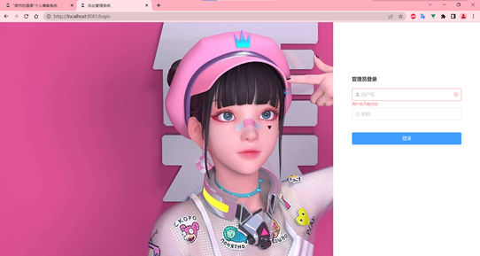
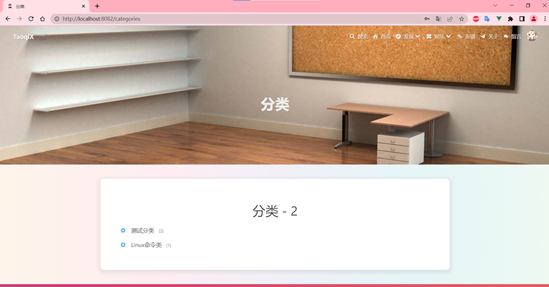
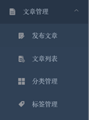
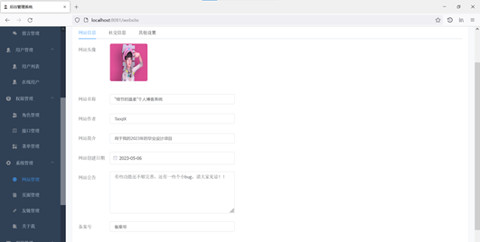

# 1系统功能模块图

图1.1 系统功能模块图

# 2 项目实现

- 前端：

项目开发技术：Vue.js

项目开发平台：VSCode

- 后端：

项目开发技术：SpringBoot

项目开发平台：IDEA

- 其他技术和规矩：

MySQL8.0数据库，ElementUI组件库，redis

## 2.1 网站首页的实现

用户不需要登录或注册就可以进入首页，访问地址为<http://localhost:8082/>，以一张图片作为整个界面的背景，中间写着“细节的温柔”个人博客系统，也就是本系统的名字，往下划动，显示的就是一些文章。

网站首页模块的界面如图2.1-图2.2所示.

图2.1 网站首页1

图2.2 网站首页2

## 2.2 登录模块实现

登录模块有两个地方，一个是网站前台的一个登录模块，有登录、注册和密码找回三个功能；另一个是网站后台的登录模块，输入正确的管理员的用户名和密码后，就能进入博客系统的后台管理界面。

登录模块的界面如图2.3-图2.5所示.

图2.3 前台登录

图2.2 前台注册

图2.5 后台登录

## 2.3 文章展示模块的实现

左边展示的是置顶文章和一些新发布的文章，右边是文章总量的概况和系统的公告，以及系统到目前为止所运行的时间。

文章展示模块的界面如图2.6所示.

图2.6 文章展示

## 2.2 搜索模块的实现

点击导航栏上的搜索这个导航菜单，就会弹出如下图所示的输入框，通过输入关键字后就能自动快速找到相应的内容。

文章展示模块的界面如图2.7所示.

图2.7 搜索模块

## 2.5 文章查询模块的实现

有归档、分类、标签三个选项。对应的有按时间归档、文章分类、文章标签三种不同的方式对文章进行排列展示。

文章展示模块的界面如图2.8-图2.11所示.

图2.8 文章查阅_发现

图2.9 文章查阅_归档

图2.10 文章查阅_分类

图2.11 文章查阅_标签

## 2.6 娱乐和留言模块的实现

有相册、说说和留言三个功能。相册功能，可以上传一些图片分享给大家欣赏。说说功能，管理员可以发布一些动态说说，更具娱乐性。留言功能，即使未登录的游客，也可以留言发表对这个系统的看法。

登录模块的界面如图2.12-图2.16所示.

图2.12 娱乐

图2.13 相册

图2.12 相册A

图2.15 说说

图2.16 留言板

## 2.7 文章管理模块的实现

在后台界面，点击左侧导航栏的消息管理菜单，就可以对文章的评论以及对系统的留言进行管理，一些不正当的言论可以及时的删除。

登录模块的界面如图2.17-图2.18所示.

图2.17 文章管理

图2.18 文章列表

## 2.8 消息管理模块的实现

消息管理包括评论管理和留言管理，就可以对文章的评论以及对系统的留言进行管理，一些不正当的言论可以及时的删除。

登录模块的界面如图2.19-图2.20所示.

图2.19 评论管理

图2.20 评论列表

## 2.9 用户管理模块的实现

用户管理，就可以对已经注册的用户进行删除、禁用以及权限管理，一些经常违规的用户可以及时的禁用或者删除。

登录模块的界面如图2.21-图2.22所示.

图2.21 用户管理

图2.22 用户列表

## 2.10 网站管理模块的实现

网站管理模块，就可以对一些网站的网站名称、网站作者、网站简介、网站公告等信息进行编辑管理。

登录模块的界面如图2.23所示.

图2.23 网站管理
